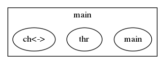
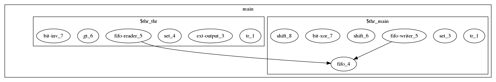

Quick Introduction
==================

==================
Installation
==================

If you are using Ubuntu, just do

.. code-block:: none

   $ sudo snap install karuta

Otherwise please see User's guide to build the binary.

========
Tutorial
========

This section illustrates some of Karuta's features using Xorshift32 method.
A simple Xorshift32 code in Karuta is like this:

.. code-block:: none

   process main() {
     var y int = 1
     for var i int = 0; i < 10; ++i {
       y = y ^ (y << 13)
       y = y ^ (y >> 17)
       y = y ^ (y << 15)
       print(y)
     }
   }

Save this to a file named xorshift32.karuta, then you can run this program like

.. code-block:: none

   $ karuta run xorshift32.karuta
   print: default-isynth.karuta loaded
   print: 268476417
   print: 1157628417
   print: 1158709409
    ...

I guess this looks pretty mundane to you, so let's start hardware design.
So you can the run same *karuta* command again and will get xorshift32.v. The content should look like this.

.. code-block:: none

   $ karuta compile xorshift32.karuta

.. code-block:: none

   ... 100~ lines of code in Verilog here. ...

   module xorshift32(clk, rst);
     input clk;
     input rst;
     xorshift32_main xorshift32_main_inst(.clk(clk), .rst(rst));
   endmodule

Then you can run this on a Verilog simulator with a testbench file to feed the clock and reset.
If you think it is tedious, *sim* command will do most of the work;

.. code-block:: none

   $ karuta sim xorshift32.karuta

The output contains an enclosing module to generate clock and reset. So you can simply run iverilog (or your simulator) to see the results.

.. code-block:: none

   $ iverilog xorshift32.v
   $ ./a.out
    268476417
   1157628417
   1158709409
    269814307
   ...

OK. Looks good? But there is a big problem. The code uses *$display()* which is useless on real FPGAs. The next step is to generate an output port from this design.
With Karuta, you can annotate a method to make it an output port. The output value is updated when the method is called. For example,

.. code-block:: none

   output o int

   process main() {
     var y int = 1
     for var i int = 0; i < 10; ++i {
       y = y ^ (y << 13); y = y ^ (y >> 17); y = y ^ (y << 15)
       o.write(y)
     }
   }

The code above will be converted to a Verilog file like as follows. The top module xorshift32 has an output port *'o'*, so you can connect the port to other parts of your design.

.. code-block:: none

   ... 100~ lines of code in Verilog here. ...

   module xorshift32(clk, rst, o);
     input clk;
     input rst;
     output [31:0] o;
     mod_main mod_main_inst(.clk(clk), .rst(rst), .o(o));
   endmodule

This can be tidied up a bit by factoring out update formulas.

.. code-block:: none

   // Member variable of the default object for this file.
   shared y int

   output o int

   // Gets an argument t and returns an update value.
   func update(t int) (int) {
     t = t ^ (t << 13); t = t ^ (t >> 17); t = t ^ (t << 15)
     return t
   }

   process main() {
     y = 1
     while true {
       y = update(y)
       o.write(y)
     }
   }

The last example here illustrates some of the most important features of Karuta such as multiple threads and channels.

.. code-block:: none

   // Enclosing module { ... } is optional here and just to make it clear
   // following members are in this module.
   module {
     // This channel can be accessed like ch.write(v) or v = ch.read()
     channel ch int

     func update(t int) (int) {
       t = t ^ (t << 13); t = t ^ (t >> 17); t = t ^ (t << 15)
       return t
     }

     // Thread entry method.
     process main() {
       var y int = 1
       while true {
         y = update(y)
         ch.write(y)
       }
     }

     output o #0

     // Thread entry method.
     process thr() {
       var b #0 = 0
       while true {
         var v int = ch.read()
         // Flip the output on-off value when the generated random number is
         // below this number.
         if v < 10000 {
           b = ~b
           o.write(b)
         }
       }
     }
   }

This code has 2 thread entry methods. One generates random numbers and the another reads the numbers via a channel.
When the code is compiled, generated Verilog code will have 2 state machines (*'always'* blocks).
You can deploy the code to an FPGA board, connect the output to an LED and see it flickers randomly.

Did this work well? I hope you got the idea of Karuta's approach to hardware design.

--------------------
Visualize the design
--------------------

Karuta has features to visualize designs. They will help you to understand or explain complex designs in Karuta.
One is to visualize the structure of objects in Karuta language.

Another one is to visualized the structure of modules and FSMs after synthesis.

========
Features
========

Karuta's 10 important features you might like...

* New scripting language with contemporary syntax designed primarily for hardware design
* Prototype based OOP
* Static thread concurrency
* Channels and mailboxes
* Attach AXI DMA controller to arrays
* Distance between objects can be specified
* Custom data width and numeric operations
* Interfaces to/from circuits outside
* HDL embedding
* Optimization techniques like PGO and SSA
